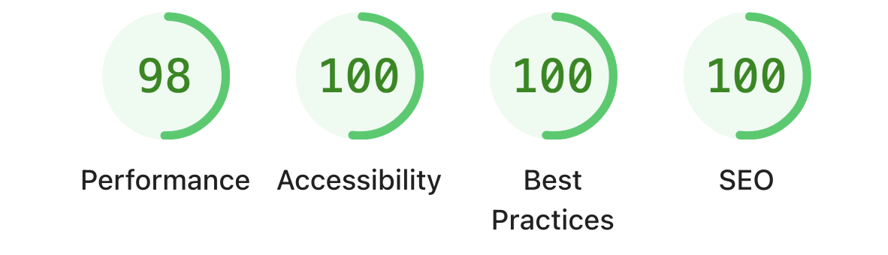
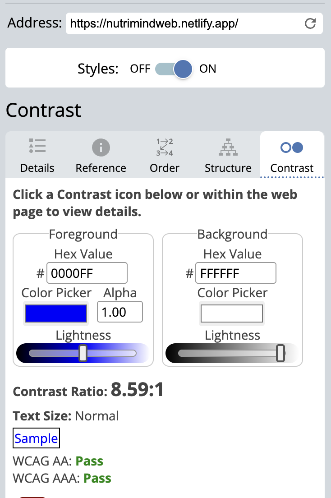
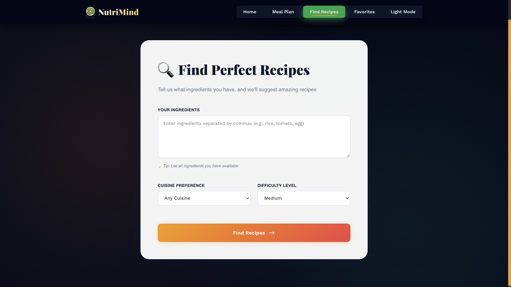
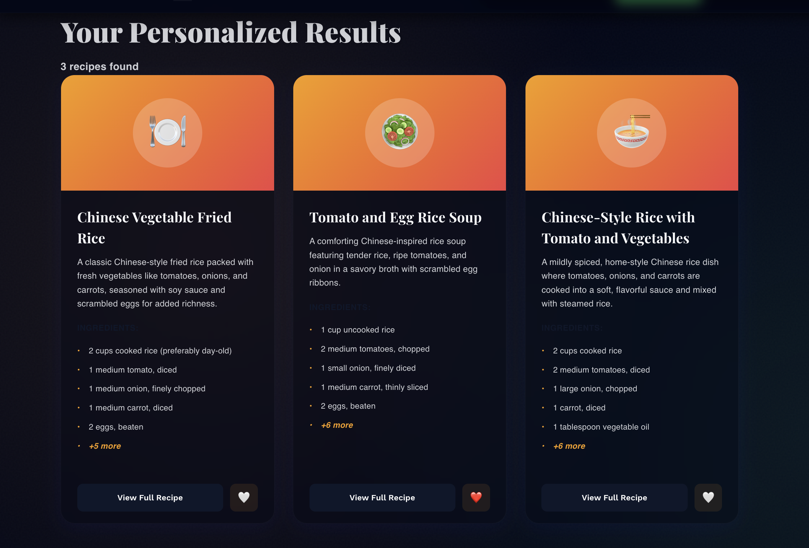

# 🥗 NutriMind - AI-Powered Meal & Recipe Planner


NutriMind is an intelligent web application that revolutionizes meal planning and recipe discovery using advanced AI. Built with React, FastAPI, and Fetch AI, it provides personalized nutrition guidance and creative recipe suggestions.

## Features

### Core Features
- **AI Meal Planning**: Generate personalized meal plans based on dietary goals, calorie targets and restrictions
- **Smart Recipe Finder**: Discover creative recipes based on available ingredients
- **Nutritional Insights**: Detailed macronutrient breakdowns for every meal
- **Accessible Design**: WCAG Level AA compliant
- **Responsive**: Optimized for desktop, tablet, and mobile devices

### Technical Highlights
- Real-time AI-powered suggestions using Fetch AI ASI Mini
- Type-safe React with TypeScript
- RESTful API with FastAPI
- Smooth animations with Framer Motion
- Glassmorphism design with modern CSS

## Project Structure

```
nutrimind/
├── frontend/                 # React TypeScript Frontend
│   ├── public/
│   ├── src/
│   │   ├── components/      # React Components
│   │   │   ├── Hero.tsx
│   │   │   ├── Hero.css
│   │   │   ├── Navigation.tsx
│   │   │   ├── Navigation.css
│   │   │   ├── DietForm.tsx
│   │   │   ├── DietForm.css
│   │   │   ├── IngredientForm.tsx
│   │   │   ├── IngredientForm.css
│   │   │   ├── RecipeCards.tsx
│   │   │   └── RecipeCards.css
│   │   ├── App.tsx          # Main App Component
│   │   ├── App.css          # Global Styles
│   │   └── index.tsx        # Entry Point
│   ├── package.json
│   └── tsconfig.json
│
└── backend/                 # FastAPI Backend
    ├── main.py             # FastAPI Application
    ├── requirements.txt    # Python Dependencies
    ├── .env               # Environment
    └── README.md          # Backend Documentation
```

## Getting Started

### Backend Setup

1. **Navigate to backend directory**
   ```bash
   cd backend
   ```

2. **Create virtual environment**
   ```bash
   python3 -m venv venv
   source venv/bin/activate  # On Windows: venv\Scripts\activate
   ```

3. **Install dependencies**
   ```bash
   pip install -r requirements.txt
   ```

4. **Configure environment variables**
   ```bash
   cp .env.example .env
   ```
   
   Edit `.env` and add your Fetch API key:
   ```
   FETCH_API_KEY=your_actual_api_key_here
   ```

5. **Run the backend server**
   ```bash
   python -m uvicorn app.main:app --reload
   ```
   
   Backend will be available at: `http://localhost:8000`
   
   API Documentation: `http://localhost:8000/docs`

### Frontend Setup

1. **Navigate to frontend directory**
   ```bash
   cd frontend
   ```

2. **Install dependencies**
   ```bash
   npm install
   ```

3. **Start development server**
   ```bash
   npm start
   ```
   
   Frontend will be available at: `http://localhost:3000`

## 📡 API Endpoints

### POST /api/meal-plan
Generate a personalized meal plan

**Request Body:**
```json
{
  "dietType": "balanced",
  "calories": 2000,
  "protein": "moderate",
  "restrictions": "no nuts, dairy-free",
  "meals": 3
}
```

**Response:**
```json
{
  "meals": [
    {
      "id": "meal-1",
      "name": "Grilled Chicken Power Bowl",
      "description": "Protein-packed bowl with fresh vegetables",
      "calories": 450,
      "protein": 35,
      "carbs": 40,
      "fat": 15,
      "ingredients": ["chicken breast", "quinoa", "broccoli"],
      "instructions": ["Grill chicken...", "Cook quinoa..."],
      "cookTime": "25 mins",
      "servings": 1
    }
  ],
  "success": true
}
```

### POST /api/recipes
Find recipes based on ingredients

**Request Body:**
```json
{
  "ingredients": ["chicken", "rice", "tomatoes"],
  "cuisine": "italian",
  "difficulty": "medium"
}
```

**Response:**
```json
{
  "recipes": [
    {
      "id": "recipe-1",
      "name": "Tuscan Chicken Rice",
      "description": "A comforting Italian-inspired dish",
      "calories": 520,
      "protein": 38,
      "carbs": 55,
      "fat": 12,
      "ingredients": ["2 chicken breasts", "1 cup rice"],
      "instructions": ["Season chicken...", "Cook rice..."],
      "cookTime": "35 mins",
      "servings": 2
    }
  ],
  "success": true
}
```


## Performance Metrics



## Deployment

# Frontend deployed on Netlify
# Backend deployed on Render
# URL: https://nutrimindweb.netlify.app/






## AI Tools used

- Fetch AI: API Key
- Claude: Code Generation
- ChatGPT: Debugging 


---

**Built with ❤️ by Team UIBot**
